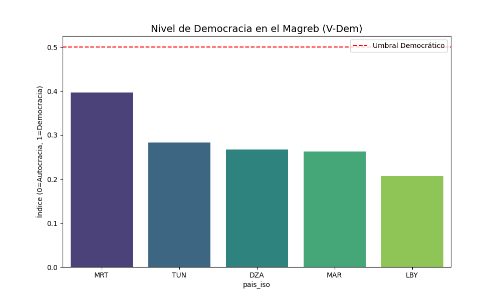

# PROMPTS.md - Registro de Interacciones con IA

Este archivo es **CRÍTICO** para tu evaluación. Aquí debes documentar cómo usaste la IA.

---

## PARTE 1: TUS PROMPTS REALES (Copia y Pega)

Pega aquí los prompts **tal cual** los escribiste, con errores y todo.
Sepáralos por bloque (A, B, C).

### Bloque A: Infraestructura (Docker)

**Prompt 1 (El problema inicial de ejecución):**
> deseo ejecutar la descarga de la base de datos, ojo que estoy trabajando en docker, pero me esta saliendo error

**Prompt 2 (El error clave de `spark-submit`):**
> (.venv) (base) clubability@clubs-MacBook-Pro rivasplata_carlos % docker compose exec spark-master spark-submit /workspace/src/01_pipeline_spark.py
> OCI runtime exec failed: exec failed: unable to start container process: exec: "spark-submit": executable file not found in $PATH

**Prompt 3 (El error clave de los volúmenes de Docker):**
> (.venv) (base) clubability@clubs-MacBook-Pro rivasplata_carlos % docker compose exec spark-master pip install -r /workspace/requirements.txt
> ERROR: Could not open requirements file: [Errno 21] Is a directory: '/workspace/requirements.txt'

**Prompt 4 (El error de permisos de instalación):**
> ERROR: Could not install packages due to an EnvironmentError: [Errno 13] Permission denied: '/home/spark'
> Check the permissions.

### Bloque B: Pipeline ETL (Spark)

**Prompt 1 (El error de incompatibilidad que nos forzó a usar solo Docker):**
> TypeError: code() argument 13 must be str, not int

**Prompt 2 (La definición del tema que cambió todo el enfoque):**
> el tema que debo tratar en mi prpyecto es: desarrollo politico-economico: magreb, autoritarismo vs democracia, por lo tanto deben estar todos los paises del magreb mencionados

**Prompt 3 (El error específico de Spark que nos enseñó sobre los tipos de datos):**
> pyspark.errors.exceptions.captured.AnalysisException: [UNSUPPORTED_DATA_TYPE_FOR_DATASOURCE] The Parquet datasource doesn't support the column `pib_pc` of the type "VOID".

**Prompt 4 (La petición de unificar todo el código):**
> la descarga de la base de datos QoG debe estar incluido todo en el archivo pipeline.py, y borrar el archivo py que hace la descarga, la ubicacion de la base de datos descargada (archivo csv) debe guardarse donde esta ahora, pero como ya esta descargada debe sobreescribirse y no generar otra.

### Bloque C: Análisis (Gráficos)

**Prompt 1 (La decisión de pivotar el análisis y abandonar Hausman):**
> si esta bien, reemplazalo, recuerda que el analisis de hausman es para analisis de modelo de datos utilizar (de lospropuestos por el docente)

**Prompt 2 (La petición de enriquecer el análisis con más visualizaciones):**
> en mi archivo pipeline.py me gustaria anador por lo menos 2 graficos mas que sustentes mas mi investigacion sobre el tema del magregreb

**Prompt 3 (El prompt de depuración que resolvió el problema de la imagen invisible):**
> o quizas sea que en el archivo resultados se uso el siguiente codigo para visualizar las imagenes:
> ## 2. Gráfico 1: Nivel de Democracia en el Magreb
> 

---

## PARTE 2: BLUEPRINT GENERADO POR IA (Opcional / Final)

### Bloque A: Infraestructura Docker

**Prompt Profesional:**
> "Diseña un `docker-compose.yml` para un pipeline de Big Data con PySpark. La infraestructura debe incluir un servicio de PostgreSQL (`postgres:16-alpine`), un Spark Master y al menos un Spark Worker (`apache/spark:3.5.4-python3`). Configura los volúmenes para montar las carpetas locales `datos`, `src`, `outputs`, así como los archivos `requirements.txt` y `pipeline.py`, en la ruta `/workspace` dentro de los contenedores de Spark. Asegura que el Spark Master exponga su UI en el puerto `8080` y que los workers se conecten correctamente. Incluye un `healthcheck` para el servicio de PostgreSQL."

### Bloque B: Pipeline ETL con Spark

**Prompt Profesional:**
> "Desarrolla un script `pipeline.py` que orqueste la descarga, el ETL con PySpark y el análisis de datos.
>
> **Fase 1: Descarga de Datos.** Implementa una función para descargar el dataset QoG Cross-Section (`qog_std_cs_jan26.csv`) desde `https://www.qogdata.pol.gu.se/data/qog_std_cs_jan26.csv` a `/workspace/datos/qog/`, asegurando que el directorio exista y sobrescribiendo el archivo si ya está presente.
>
> **Fase 2: ETL con PySpark.** El script debe:
> 1.  Crear una `SparkSession`.
> 2.  Leer el CSV descargado, infiriendo el esquema.
> 3.  Seleccionar y renombrar variables clave para 'Democracia', 'PIB per Cápita', 'Corrupción', 'Estabilidad Política' y 'Esperanza de Vida'. Utiliza listas de candidatos (`vdem_polyarchy` o `polity2` para Democracia, `wdi_gdppc` o `mad_gdppc` para PIB, etc.) para una selección robusta. Si una variable no se encuentra, debe crearse como `NULL` pero casteada explícitamente a un tipo compatible con Parquet (ej., `DoubleType` o `StringType`).
> 4.  Filtrar los datos para incluir únicamente los países del Magreb (MAR, DZA, TUN, LBY, MRT) usando el código ISO-3 (`ccodealp`).
> 5.  Crear al menos dos variables derivadas: una 'Categoría de Régimen' (ej., 'Autoritario', 'Híbrido', 'Democracia') basada en el índice de democracia, y un 'Índice de Desarrollo Institucional' (ej., `log(PIB) * (Corrupción/100)`).
> 6.  Guardar el DataFrame procesado en formato Parquet en `/workspace/outputs/parquet/magreb_qog_analisis`, sobrescribiendo si existe.
> 7.  Asegurar que el script sea ejecutable mediante `spark-submit` dentro del entorno Dockerizado de Spark, incluyendo la configuración necesaria para que PySpark encuentre sus librerías (`sys.path` y `SPARK_HOME`)."

### Bloque C: Análisis y Visualización

**Prompt Profesional:**
> "Extiende el `pipeline.py` para incluir una fase de análisis exploratorio de datos (EDA) y visualización utilizando Pandas, Matplotlib y Seaborn, inmediatamente después de la fase ETL. El análisis debe:
> 1.  Cargar los datos procesados en Parquet utilizando Pandas.
> 2.  Incluir una justificación explícita en la salida de la terminal sobre por qué se elige un análisis comparativo/correlacional, descartando modelos de series temporales o clustering complejo, dada la naturaleza Cross-Sectional del dataset.
> 3.  Mostrar estadísticas descriptivas básicas (`.describe()`) y un conteo de valores nulos (`.isnull().sum()`).
> 4.  Generar y guardar cinco gráficos de alta calidad en `/workspace/outputs/graficos/`:
>     *   Un gráfico de barras comparando los niveles de democracia en los países del Magreb.
>     *   Un gráfico de dispersión (scatter plot) mostrando la relación entre el PIB per Cápita y la Democracia, con etiquetas de país.
>     *   Un mapa de calor (heatmap) de la matriz de correlación entre las variables numéricas clave (democracia, pib_pc, corrupcion, estabilidad, esperanza_vida).
>     *   Un gráfico de barras agrupadas comparando la Estabilidad Política y el Control de Corrupción (normalizados) por país.
>     *   Un gráfico de burbujas (bubble plot) mostrando la Esperanza de Vida vs. PIB per Cápita, donde el tamaño de la burbuja represente el nivel de Democracia.
> 5.  Asegurar que todos los gráficos tengan títulos, etiquetas de ejes y leyendas claras, y se guarden como archivos `.png` (o `.jpeg` para la Spark UI) en la carpeta designada.
> 6.  Proporcionar las instrucciones para la instalación de las librerías Python necesarias (`pandas`, `matplotlib`, `seaborn`, `pyarrow`, `requests`) dentro del contenedor Docker, incluyendo la ejecución con permisos de `root` (`-u 0`) para resolver problemas de permisos."
