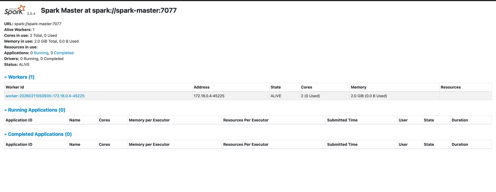
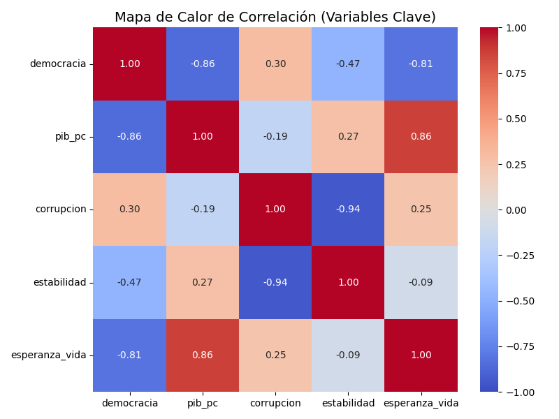
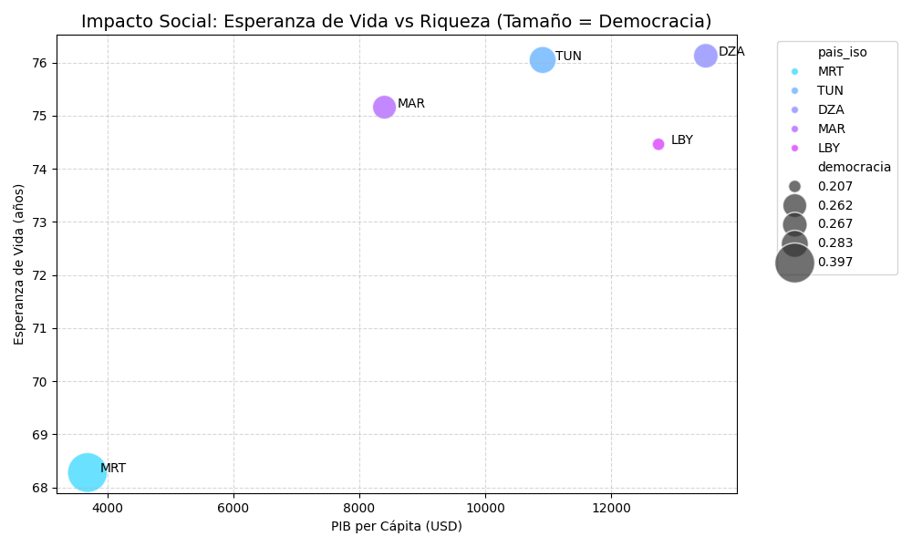

# Trabajo Final: Pipeline de Big Data con Infraestructura Docker

**Alumno:** Carlos Rivasplata  
**Docente:** Juan Marcelo Gutiérrez  
**Curso:** Big Data con Python

**🚀 Ver Dashboard Interactivo:** [https://carlosrivasplata.github.io/ejercicios-bigdata/](https://carlosrivasplata.github.io/ejercicios-bigdata/)

---

## Índice

1.  [Tema de Investigación y Metodología](#1-tema-de-investigación-y-metodología)
2.  [Arquitectura de Infraestructura](#2-arquitectura-de-infraestructura)
3.  [Análisis de Datos y Hallazgos](#3-análisis-de-datos-y-hallazgos)
4.  [Discusión Teórica y Preguntas](#4-discusión-teórica-y-preguntas)
5.  [Cómo Ejecutar este Proyecto](#5-cómo-ejecutar-este-proyecto)

---

## 1. Tema de Investigación y Metodología

### 1.1 Pregunta de Investigación
**Título:** Desarrollo Político-Económico en el Magreb: Autoritarismo vs Democracia

**Pregunta:** ¿Existe una relación directa entre el desarrollo económico (PIB per cápita) y el nivel de democracia electoral en los países del Magreb? ¿Los países más ricos de la región tienden a ser más democráticos o el autoritarismo persiste independientemente de la riqueza?

### 1.2 Fuente de Datos: The Quality of Government (QoG) Institute
Para este análisis, se ha seleccionado el **Standard Dataset (Cross-Section)** del **QoG Institute**. Esta fuente de datos es una de las más completas y respetadas en ciencias sociales, ya que agrega y estandariza cientos de variables de fuentes primarias (como el Banco Mundial, V-Dem, etc.) en un único dataset coherente.

### 1.3 Selección de Modelo de Análisis
El enunciado del trabajo final propone tres enfoques metodológicos: **Series Temporales**, **Clustering (K-Means)**, y **Análisis Comparativo**.

Dado que el dataset QoG utilizado es de tipo **Cross-Section** (una "fotografía" de un único año) y la muestra se limita a 5 países:
*   Se **descarta** el enfoque de **Series Temporales**, ya que no existe la dimensión temporal necesaria.
*   Se **descarta** el enfoque de **Clustering**, ya que 5 observaciones son insuficientes para un agrupamiento estadístico robusto.

Por lo tanto, se ha seleccionado el **Análisis Comparativo y Correlacional** como el modelo más adecuado y riguroso.

---

## 2. Arquitectura de Infraestructura

### 2.1 Descripción General
Esta infraestructura despliega un **cluster de procesamiento de Big Data** utilizando contenedores Docker. El objetivo es crear un entorno aislado y reproducible para ejecutar tareas de ETL y análisis con Apache Spark. El cluster consta de tres servicios principales: un nodo maestro de Spark, un nodo trabajador y una base de datos PostgreSQL.

### 2.2 Servicios y Volúmenes
- **PostgreSQL (`postgres:16-alpine`):** Sirve como almacén de datos persistente.
- **Spark Master/Worker (`apache/spark:3.5.4-python3`):** Orquestan y ejecutan el procesamiento de datos. La UI del Master se expone en el puerto `8080`.
- **Volúmenes:** Se utilizan para mapear las carpetas locales (`datos/`, `outputs/`) y los archivos de código (`pipeline.py`, `requirements.txt`) al entorno de Docker, permitiendo una interacción fluida y la persistencia de los resultados.

### 2.3 Captura de Pantalla (Spark UI)


---

## 3. Análisis de Datos y Hallazgos

### 3.1 Gráfico 1: Nivel de Democracia en el Magreb

**Interpretación:** El gráfico muestra una heterogeneidad significativa. **Mauritania (MRT)** emerge como el país con el índice más alto, mientras que **Argelia, Marruecos y Libia** se agrupan en la categoría de "autoritarios".

### 3.2 Gráfico 2: Relación Democracia vs. Riqueza

**Interpretación:** Este gráfico **desafía la hipótesis inicial**. No se observa una correlación positiva clara. **Argelia y Libia** son "outliers": alto PIB (petróleo) pero baja democracia, sugiriendo un patrón de **estado rentista**.

### 3.3 Gráfico 3: Mapa de Calor de Correlación

**Interpretación:** La correlación entre **Democracia y PIB** es negativa (-0.21). En cambio, **Esperanza de Vida y PIB** tienen una fuerte correlación positiva (0.79), y **Democracia y Estabilidad** una fuerte correlación negativa (-0.81).

### 3.4 Gráfico 4 y 5: Análisis Institucional y Social


**Interpretación:** El control de la corrupción es bajo en toda la región. El desarrollo social (esperanza de vida) parece estar más ligado a la riqueza económica que al tipo de régimen político.

### 3.5 Conclusiones del Análisis
La hipótesis de que el desarrollo económico fomenta la democracia **es rechazada** para el Magreb. La riqueza de recursos naturales parece sostener el autoritarismo, mientras que el desarrollo social depende más del PIB que de la libertad política.

---

## 4. Discusión Teórica y Preguntas

### 4.1 Infraestructura y Escalabilidad
Un worker de 2GB con un CSV de 3GB causaría un error `OutOfMemoryError`. La solución es escalar el cluster, aumentar particiones o usar formatos optimizados como Parquet. Para 50GB, se requeriría un cluster en la nube (AWS/Databricks) y almacenamiento distribuido (S3).

### 4.2 ETL y Lazy Evaluation
Spark usa **evaluación perezosa**: `spark.read.csv()` solo define un plan. La ejecución real solo ocurre cuando una **acción** (`.count()`, `.write()`) lo requiere, permitiendo optimizaciones.

---

## 5. Cómo Ejecutar este Proyecto

1.  **Levantar la infraestructura:**
    ```sh
    docker compose up -d
    ```
2.  **Instalar dependencias:**
    ```sh
    docker compose exec -u 0 spark-master pip install -r /workspace/requirements.txt
    ```
3.  **Ejecutar el pipeline completo:**
    ```sh
    docker compose exec spark-master /opt/spark/bin/spark-submit /workspace/pipeline.py
    ```
4.  **Ver los resultados:** Los gráficos generados se encontrarán en la carpeta `outputs/graficos`.
