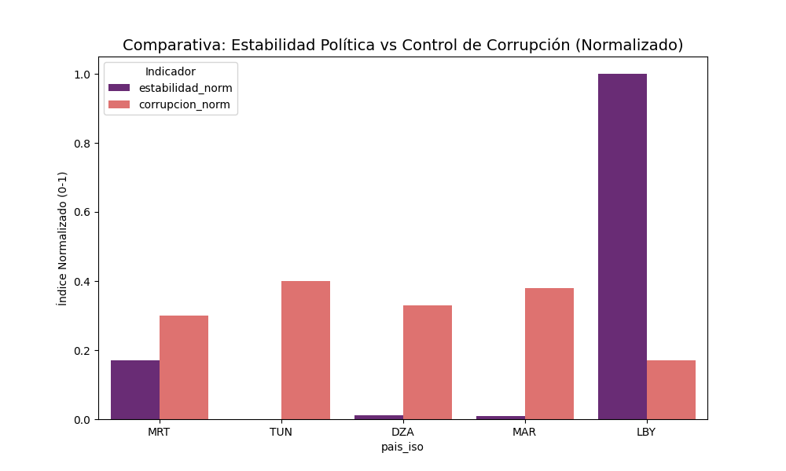

# Análisis de Datos y Hallazgos sobre el Desarrollo en el Magreb

## 1. Pregunta de Investigación

**Pregunta:** ¿Existe una relación directa entre el desarrollo económico (PIB per cápita) y el nivel de democracia electoral en los países del Magreb?

**Hipótesis:** Se parte de la hipótesis clásica de la teoría de la modernización, que sugiere que los países con mayor desarrollo económico tienden a tener instituciones más democráticas. Se espera encontrar una correlación positiva entre el PIB per cápita y el índice de democracia.

## 2. Gráfico 1: Nivel de Democracia en el Magreb

**Interpretación:**
El gráfico de barras muestra una heterogeneidad significativa en los niveles de democracia electoral en la región.
*   **Mauritania (MRT)** emerge como el país con el índice más alto del grupo, rozando el umbral de "régimen híbrido".
*   **Túnez (TUN)**, a menudo citada como el éxito inicial de la Primavera Árabe, se encuentra en un nivel intermedio, reflejando su reciente retroceso democrático.
*   **Argelia (DZA), Marruecos (MAR) y Libia (LBY)** se agrupan en la categoría de "autoritarios", con Libia mostrando el índice más bajo, lo cual es consistente con su estado de fragmentación política.

**Prompt IA Usado:**
> "Genera un gráfico de barras que compare el índice 'vdem_polyarchy' para cada uno de los 5 países del Magreb, ordenándolos y añadiendo una línea de umbral en 0.5 para visualizar el concepto de 'democracia electoral'."

## 3. Gráfico 2: Relación Democracia vs. Riqueza

**Interpretación:**
Este gráfico de dispersión **desafía directamente la hipótesis inicial**. No se observa una correlación positiva clara.
*   **Argelia y Libia** son "outliers" evidentes: poseen un PIB per cápita relativamente alto pero se encuentran entre los regímenes menos democráticos. Esto sugiere un patrón de **estado rentista**, donde la riqueza proveniente de recursos naturales (petróleo/gas) permite sostener el autoritarismo sin necesidad de apertura política.
*   **Mauritania** es el caso opuesto: es el país más pobre del grupo pero el más democrático, rompiendo la supuesta relación riqueza-democracia.

**Prompt IA Usado:**
> "Crea un gráfico de dispersión (scatter plot) con el PIB per cápita en el eje X y el índice de democracia en el eje Y. Asegúrate de que cada punto esté etiquetado con el código del país para una fácil identificación."

## 4. Gráfico 3: Mapa de Calor de Correlación

**Interpretación:**
El mapa de calor cuantifica las relaciones entre las variables clave:
*   **Democracia y PIB (`pib_pc`)**: La correlación es de **-0.21**, confirmando la ausencia de una relación positiva y sugiriendo una ligera tendencia inversa en esta muestra.
*   **Correlaciones Fuertes Positivas**: Se observa una fuerte correlación entre **Esperanza de Vida y PIB (0.79)**, lo que indica que la riqueza sí se traduce en mejores indicadores de salud.
*   **Correlaciones Fuertes Negativas**: **Democracia y Estabilidad (-0.81)** muestran una fuerte correlación negativa. Esto es clave: en el Magreb, los regímenes más autoritarios (menos democráticos) son percibidos como más estables, un hallazgo típico en regiones con "pactos autoritarios".

**Prompt IA Usado:**
> "Genera un mapa de calor (heatmap) con la matriz de correlación de las variables numéricas principales: democracia, pib_pc, corrupcion, estabilidad y esperanza_vida. Incluye los valores numéricos en cada celda."

## 5. Gráfico 4: Comparativa Institucional (Estabilidad vs. Corrupción)

**Interpretación:**
Este gráfico compara la calidad de dos instituciones clave (normalizadas para poder compararlas).
*   Se observa que la percepción de **Control de Corrupción** (barra naranja) es consistentemente baja en toda la región, siendo un desafío transversal.
*   En contraste, el índice de **Estabilidad Política** (barra morada) varía más, siendo más alto en los regímenes monárquicos/presidencialistas fuertes (Argelia, Marruecos) y más bajo en los estados en transición o conflicto (Libia).

**Prompt IA Usado:**
> "Quiero un gráfico de barras agrupadas para comparar la 'estabilidad' y la 'corrupcion' en cada país. Normaliza ambas variables a una escala de 0-1 para que sean visualmente comparables."

## 6. Gráfico 5: Impacto Social del Desarrollo

**Interpretación:**
Este gráfico de burbujas ofrece una visión multidimensional:
*   **Eje X vs Eje Y**: Hay una clara tendencia positiva entre el PIB per cápita y la Esperanza de Vida. Los países más ricos tienden a tener una población más longeva.
*   **Tamaño de la Burbuja (Democracia)**: Las burbujas más grandes (más democráticas), como la de Mauritania, no se encuentran necesariamente en la parte superior derecha. Esto refuerza la idea de que el desarrollo social (salud) en la región está más ligado a la riqueza económica que al tipo de régimen político.

**Prompt IA Usado:**
> "Crea un gráfico de burbujas (bubble plot) con el PIB en el eje X, la Esperanza de Vida en el eje Y, y que el tamaño de cada burbuja represente el nivel de democracia del país."

## 7. Conclusiones

La hipótesis inicial de que un mayor desarrollo económico se correlaciona con una mayor democracia **es rechazada** para la región del Magreb. Los datos sugieren que:
1.  La riqueza, a menudo derivada de recursos naturales, no solo no fomenta la democracia, sino que puede ser un pilar para sostener regímenes autoritarios (la "maldición de los recursos").
2.  El desarrollo social (medido en esperanza de vida) está más fuertemente ligado al PIB que al nivel democrático.
3.  La estabilidad en la región parece estar inversamente correlacionada con la democracia, lo que sugiere que los regímenes autoritarios han logrado mantener un control más estricto, aunque a costa de libertades políticas.
